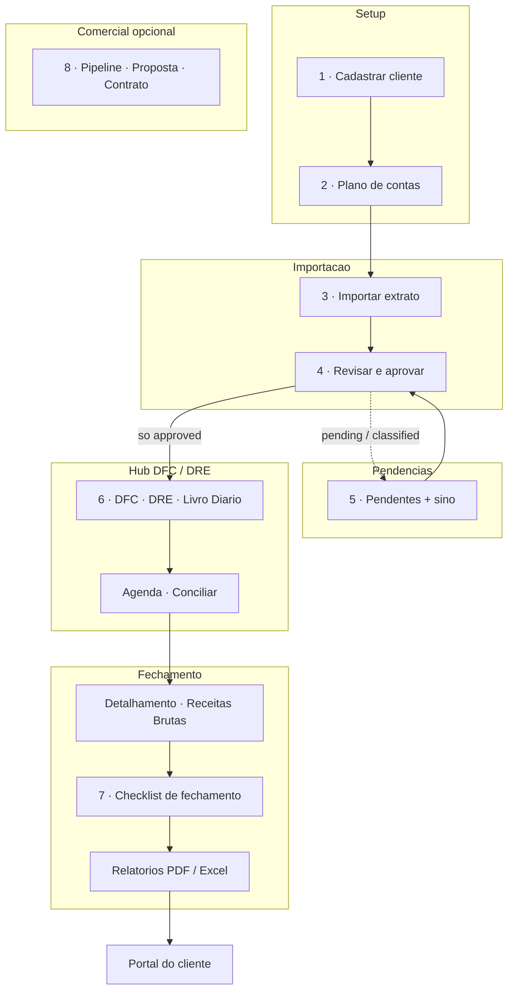
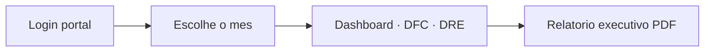
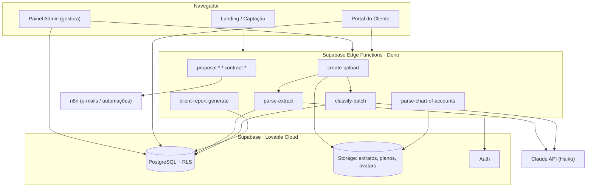
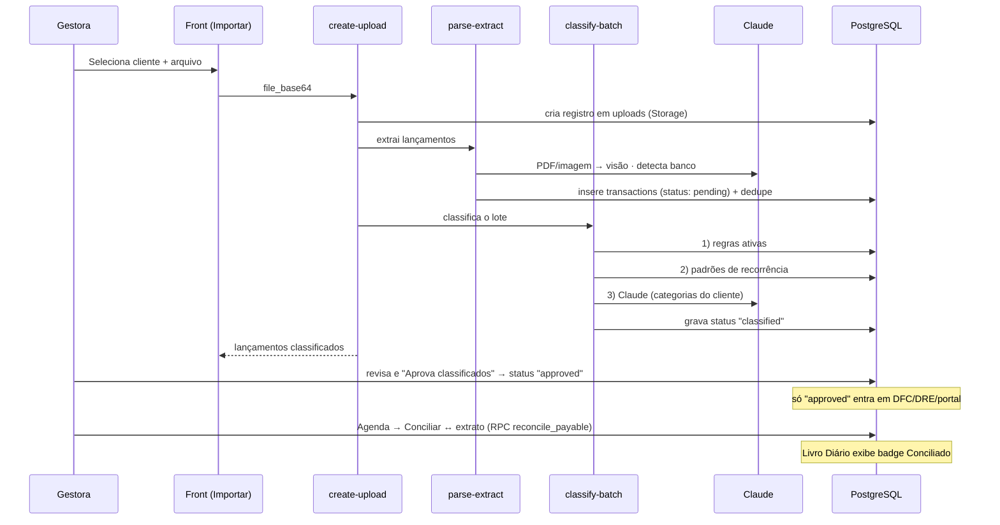

# Aurora · Gestão Financeira

Plataforma de gestão financeira terceirizada para escritórios e pequenas empresas.
A Aurora permite que uma gestora financeira administre, num só lugar, as finanças de
múltiplos clientes — da **importação de extratos bancários com classificação por IA**
até **DFC/DRE**, **fechamento mensal**, **portal do cliente** e um **CRM comercial**
(propostas e contratos).

> **Produção:** [auroragfe.com](https://auroragfe.com) · Repositório privado · Uso interno Aurora.

---

## Índice

- [Visão geral](#visão-geral)
- [Funcionalidades](#funcionalidades)
- [Hub DFC / DRE](#hub-dfc--dre)
- [Modo de uso](#modo-de-uso)
- [Arquitetura](#arquitetura)
- [Stack](#stack)
- [Pipeline de importação](#pipeline-de-importação)
- [Estrutura do projeto](#estrutura-do-projeto)
- [Modelo de dados](#modelo-de-dados)
- [Edge Functions](#edge-functions)
- [Começando](#começando)
- [Variáveis de ambiente](#variáveis-de-ambiente)
- [Testes](#testes)
- [Deploy](#deploy)
- [Segurança](#segurança)
- [Convenções](#convenções)

---

## Visão geral

**Problema.** Uma gestora financeira que atende várias empresas gasta horas
consolidando extratos de bancos diferentes, categorizando lançamentos à mão e
montando relatórios gerenciais por cliente.

**Solução.** A Aurora centraliza esse trabalho:

- **Painel administrativo** (a gestora) — importa extratos, revisa a classificação
  automática, acompanha DFC/DRE e fecha o mês de cada cliente.
- **Portal do cliente** — cada empresa acompanha seus próprios números (com
  funcionalidades liberadas por plano e sub-perfis de acesso).
- **Motor de classificação** — regras, recorrência e IA (Claude) categorizam os
  lançamentos automaticamente; nada entra nos relatórios sem **aprovação manual**.

**Atores**

| Ator                     | Papel                                                                                             |
| ------------------------ | ------------------------------------------------------------------------------------------------- |
| **Gestora / Admin**      | Importa e revisa lançamentos, gerencia clientes, plano de contas, DFC/DRE, propostas e contratos. |
| **Cliente (owner)**      | Acesso total ao portal da própria empresa.                                                        |
| **Cliente (financeiro)** | Acesso ao portal com escopo reduzido.                                                             |

---

## Funcionalidades

### Financeiro

- **Importação de extratos** — CSV, XLSX, PDF e imagem (sem suporte a OFX); detecção
  automática do banco pelo conteúdo do arquivo; deduplicação de lançamentos reimportados;
  seleção de **período (mês/ano)** na importação.
- **Classificação automática em 3 camadas** — regras ativas → padrões de recorrência
  → Claude Haiku (com contexto do setor e do plano de contas do cliente).
- **Revisão obrigatória** — a IA marca os lançamentos como _classificados_; só entram
  em relatórios/portal após **aprovação manual** da gestora. O **sino de pendências**
  no header e as telas Importar / Extratos / Pendentes orientam esse passo.
- **Plano de Contas por cliente** — upload do plano contábil (XLSX/CSV) que vira as
  categorias usadas pela IA. Novos clientes **não** recebem mais as 16 categorias padrão
  Aurora; ao subir o plano do cliente, as categorias seed são desativadas.
- **Categorias e Regras de Classificação** — configuráveis por cliente (inclui grupo
  _Receita não Operacional_).
- **DFC Gerencial e DRE** — por cliente e período, com coluna **Esperado** (Realizado /
  % / Var % / Esperado via payables em aberto), projeção de fluxo de caixa e **Livro
  Diário** (visão cronológica agendado vs realizado).
- **Conciliação Agenda ↔ Extrato** — vincular contas da Agenda a lançamentos aprovados
  do extrato (manual, com sugestão pós-aprovação); anti-duplicata na reimportação.
- **Fechamento mensal reabível**, Detalhamento (inclui **Receitas Brutas**) e
  **Relatórios multi-mês** — exportação em **PDF** e **Excel** por intervalo customizado.
- **Agenda (contas a pagar/receber)**, **Recorrências** e **lançamentos parcelados**.

### Portal do cliente

- Dashboard financeiro, DFC/DRE e relatórios da própria empresa.
- Funcionalidades liberadas por plano (`portal_features`) e sub-perfis (owner/financeiro).
- Geração de relatório executivo em PDF.

### Comercial (CRM)

- **Pipeline** de negócios (funil com arrastar-e-soltar entre etapas).
- **Propostas** e **contratos** com numeração automática, envio por e-mail (n8n) e
  aceite/assinatura via link com token; expiração automática de propostas.
- **Precificação** — histórico de preços de serviços e insights.
- **Landing page** com captação de leads.

### Plataforma

- Autenticação e autorização com RLS por papel.
- Notificações web push.
- Observabilidade: logs, contadores e limitação de taxa (rate limit).

---

## Hub DFC / DRE

A rota **`/admin/dfc`** concentra a operação financeira por cliente (equivalente ao menu
YAMPA). Abas disponíveis:

| Aba | Função |
| --- | --- |
| **DFC** | Fluxo de caixa gerencial com coluna Esperado |
| **DRE** | Demonstrativo de resultado |
| **Detalhamento** | Breakdown por conta; cadastro de **Receitas Brutas** |
| **Agenda** | Contas a pagar/receber; botão **Conciliar** com extrato |
| **Livro Diário** | Cronologia agendado vs realizado (badge Conciliado) |
| **Extratos do banco** | Histórico e aprovação por upload |
| **Recorrências** | Fila de padrões recorrentes pendentes |
| **Fechamento** | Checklist mensal (reabível após concluído) |

---

## Modo de uso

### Gestora (painel administrativo)

Visão do **ciclo mensal** por cliente — da configuração inicial ao fechamento:



| Etapa | Rota principal | Resultado |
| ----- | -------------- | --------- |
| 1–2 | `/admin/clientes` · `/admin/plano-contas` | Cliente pronto para operar |
| 3–5 | `/admin/importar` · `/admin/pendentes` | Lançamentos `approved` |
| 6 | `/admin/dfc` (8 abas) | Caixa, conciliação, livro diário |
| 7 | Fechamento · Detalhamento · `/admin/relatorios` | Mês fechado e exportado |
| 8 | `/admin/pipeline` · propostas · contratos | CRM (paralelo ao financeiro) |

**1. Cadastrar o cliente**
`Clientes → Novo cliente`. Informe nome, CNPJ e dados básicos. O cliente nasce **sem
categorias** — é necessário enviar o plano de contas antes de importar extratos.

**2. Definir o plano de contas** _(obrigatório para operar)_
`Configuração → Plano de Contas → selecione o cliente → envie o arquivo` (XLSX/CSV).
Confira a **prévia** das contas e clique em **Adicionar contas ao plano**. As contas
passam a ser usadas pela IA na classificação e se repetem todos os meses.

**3. Importar o extrato**
`Importar Extratos → selecione o cliente e o período → arraste o arquivo`
(CSV, XLSX, PDF ou imagem). O sistema detecta o banco, extrai os lançamentos e a IA
classifica automaticamente em segundos. Vários arquivos podem ser enviados de uma vez.

**4. Revisar e aprovar**
Na tela de revisão, cada lançamento aparece como:

- **Classificado** — categorizado pela IA, aguardando sua conferência;
- **Pendente** — sem categoria (defina-a antes de aprovar).

Ajuste categorias/valores se necessário e clique em **Aprovar classificados**.
Só depois disso os lançamentos entram em DFC/DRE, relatórios e no portal do cliente.
Enquanto houver pendências, o **sino** no topo direito mostra a contagem e link para
`Pendentes`. Para descartar tudo, use **Cancelar envio** (remove o extrato do histórico).

**5. Tratar pendências**
`Pendentes` lista lançamentos **sem categoria** (`pending`) e **classificados aguardando
aprovação** (`classified`) de todos os clientes. A coluna **confiança** ajuda a priorizar
revisões. Categorize, ajuste e aprove por ali. Categorias aprovadas repetidamente viram
**regras automáticas**.

**6. Analisar DFC / DRE e conciliar**
`DFC / DRE` (hub com 8 abas — ver tabela acima) mostra fluxo de caixa, DRE, livro
diário e fechamento por período. Após aprovar extratos, use **Agenda → Conciliar** para
vincular contas agendadas a lançamentos do banco (ou siga o toast _Ver Agenda_ pós-aprovação).

**7. Fechar o mês e exportar**
Na aba **Fechamento**, valide o checklist (com links para cada etapa); cadastre **Receitas
Brutas** em **Detalhamento**. Fechamento concluído pode ser **reaberto** para editar
etapas. Em `Relatórios`, exporte **PDF** ou **Excel** por **intervalo multi-mês**
(trimestre, semestre ou range livre).

**8. Comercial (opcional)**
`Pipeline` move negócios entre etapas; a partir de um negócio você gera uma
**proposta**, envia por e-mail e acompanha o **aceite**; aceita, vira **contrato**.

### Cliente (portal)

Fluxo simplificado — só vê lançamentos já **aprovados** pela gestora:



1. Acessa com o usuário criado pela gestora (perfil **owner** ou **financeiro**).
2. No **portal**, escolhe o mês e acompanha os próprios indicadores, DFC/DRE e
   relatórios — limitados às funcionalidades liberadas no seu plano.
3. Pode baixar o **relatório executivo** em PDF.

### Meu perfil

No menu do usuário (topo direito) → **Meu perfil**: edite o nome, **troque a foto**
(com ajuste de posição e zoom) ou **remova a foto**.

---

## Arquitetura



O front-end lê dados diretamente do PostgreSQL via `@supabase/supabase-js` (protegido
por **Row Level Security**) e usa **Edge Functions** para operações que exigem
`service_role`, IA ou integrações externas.

---

## Stack

| Camada           | Tecnologia                                                | Por quê                                                        |
| ---------------- | --------------------------------------------------------- | -------------------------------------------------------------- |
| **Frontend**     | React 19 + TanStack Router/Start                          | Roteamento por arquivos, type-safe, SSR-ready.                 |
| **Build**        | Vite 7 (`@lovable.dev/vite-tanstack-config`)              | Configuração unificada da Lovable.                             |
| **UI**           | Tailwind CSS v4, Radix UI, Framer Motion, Recharts        | Design system consistente, acessível e animado.                |
| **Estado/Dados** | TanStack Query, react-hook-form, Zod                      | Cache de dados e validação de formulários.                     |
| **Backend**      | Supabase (PostgreSQL, Auth, Storage, Edge Functions/Deno) | BaaS integrado ao Lovable Cloud.                               |
| **IA**           | Claude `claude-haiku-4-5` (Anthropic)                     | Extração de PDF/imagem (visão) e classificação de lançamentos. |
| **Automações**   | n8n                                                       | Envio de propostas/contratos e notificações.                   |
| **Planilhas**    | `xlsx` (SheetJS)                                          | Parse de XLSX/CSV e exportação Excel.                          |
| **Deploy**       | Lovable Cloud                                             | Hospedagem do front + banco + funções.                         |

---

## Pipeline de importação

O fluxo mais crítico do sistema — do upload do extrato à aprovação:



**Estados de um lançamento:** `pending` (sem categoria → tela Pendentes) →
`classified` (categorizado pela IA, aguardando aprovação — também aparece em Pendentes) →
`approved` (aprovado pela gestora, visível em relatórios e no portal).

**Conciliação (pós-aprovação):** em `DFC → Agenda`, escolha uma conta pendente e clique
**Conciliar** para vinculá-la a um lançamento aprovado do extrato. RPCs:
`reconcile_payable`, `unreconcile_payable`, `create_manual_payment`, `undo_manual_payment`.
A reimportação ignora linhas já quitadas/conciliadas (`parse-extract`).

---

## Estrutura do projeto

```
.
├── src/
│   ├── routes/               # Rotas (TanStack file-based routing)
│   │   ├── index.tsx         # Landing page
│   │   ├── login.tsx
│   │   ├── admin.*.tsx       # Painel da gestora (dashboard, clientes, DFC, importar…)
│   │   ├── portal.tsx        # Portal do cliente
│   │   └── p.proposta.$token.tsx  # Aceite público de proposta
│   ├── components/           # AdminLayout, LivroDiarioPanel, FechamentoMensalPanel…
│   ├── hooks/                # useCategories, useDFCForecast, usePushNotifications…
│   ├── lib/                  # dfcEsperado, livroDiario, reconciliation, pendingCounts…
│   └── routeTree.gen.ts      # Árvore de rotas (gerada pelo plugin)
├── tests/
│   ├── unit/                 # Jest (confidence, livroDiario, reconciliation…)
│   └── e2e/                  # Playwright (specs + helpers; fixtures locais)
├── scripts/                  # test-*.mjs (fluxos manuais contra Supabase)
├── supabase/
│   ├── functions/            # 24 Edge Functions (Deno) + _shared/
│   └── migrations/           # Migrações SQL (schema, RLS, triggers, seeds)
├── jest.config.cjs
├── playwright.config.ts
├── public/                   # Assets estáticos + service worker (push)
├── vite.config.ts
└── package.json
```

---

## Modelo de dados

Principais entidades (PostgreSQL, todas com RLS):

**Financeiro**

- `clients`, `client_banks` — clientes e seus bancos.
- `uploads` — arquivos de extrato importados (`status`, `period`, `document_type`, contadores).
- `transactions` — lançamentos (`status`, `category`, `confidence`, `payable_id`, parcelas).
- `categories` — plano de contas do cliente (com `code` contábil hierárquico).
- `classification_rules`, `recurrence_patterns` — motor de classificação.
- `chart_of_accounts_uploads` — histórico dos planos de contas enviados.
- `monthly_closings`, `monthly_revenue_entries` — fechamento mensal.
- `report_exports` — histórico de PDFs/Excel gerados.
- `payables` — agenda (contas a pagar/receber); `matched_transaction_id`, `source_upload_id`.

**Comercial**

- `leads`, `lead_sources` — captação.
- `deals`, `deal_stages`, `deal_stage_history`, `deal_activities` — pipeline.
- `proposals`, `proposal_items`, `contracts` — documentos.
- `services`, `service_price_history` — catálogo e precificação.
- `document_counters` — numeração sequencial de documentos.

**Plataforma**

- `profiles`, `user_roles`, `user_client_mapping` — identidade e autorização.
- `push_subscriptions` — notificações web push.
- `rate_limit_hits` — limitação de taxa.

---

## Edge Functions

| Função                                                    | Responsabilidade                                                                   |
| --------------------------------------------------------- | ---------------------------------------------------------------------------------- |
| `create-upload`                                           | Orquestra o upload: Storage → `parse-extract` → `classify-batch`.                  |
| `parse-extract`                                           | Extrai lançamentos (CSV/XLSX/PDF/imagem via Claude); anti-duplicata na reimportação. |
| `classify-batch`                                          | Classifica em 3 camadas; valida recorrência contra categorias ativas.              |
| `parse-chart-of-accounts`                                 | Lê o plano de contas (XLSX/CSV) e alimenta as categorias do cliente.               |
| `client-report-generate`                                  | Gera o relatório executivo do cliente.                                             |
| `pending-count` / `pipeline-kpis`                         | Contadores (pending+classified com upload) e KPIs.                                 |
| `proposal-generate/send/view/accept` · `expire-proposals` | Ciclo de vida das propostas.                                                       |
| `contract-generate/send`                                  | Geração e envio de contratos.                                                      |
| `deal-move`                                               | Movimentação no funil.                                                             |
| `lead-intake`                                             | Captação de leads (landing).                                                       |
| `analyze-client`                                          | Análise financeira assistida por IA.                                               |
| `create-admin-user` / `create-client-user` / `manage-admin-user` | Provisionamento de usuários admin e clientes.                         |
| `subscribe-push` / `send-push`                            | Notificações web push.                                                             |
| `expire-stale-rules` · `status`                           | Manutenção e healthcheck.                                                          |

**Total:** 24 funções (+ `_shared/`). Conciliação agenda ↔ extrato usa **RPCs PostgreSQL**
(`reconcile_payable`, etc.), não Edge Function dedicada.

O CORS de todas as funções é centralizado em `supabase/functions/_shared/cors.ts`.

---

## Começando

### Pré-requisitos

- **Node.js ≥ 22.12** (exigência do Vite 7)
- **npm** (ou **bun**)
- Projeto Supabase / Lovable Cloud com as variáveis de ambiente configuradas

### Instalação

```bash
npm install
```

### Desenvolvimento

```bash
npm run dev        # servidor de desenvolvimento (Vite)
npm run build      # build de produção
npm run preview    # pré-visualiza o build
npm run lint       # ESLint
npm run format     # Prettier
```

---

## Variáveis de ambiente

**Frontend (`.env`, prefixo `VITE_`)**

| Variável                                                   | Descrição                 |
| ---------------------------------------------------------- | ------------------------- |
| `VITE_SUPABASE_URL`                                        | URL do projeto Supabase.  |
| `VITE_SUPABASE_ANON_KEY` / `VITE_SUPABASE_PUBLISHABLE_KEY` | Chave pública (anon).     |
| `VITE_AURORA_APP_URL`                                      | URL pública da aplicação. |

**Testes (`.env.test`, copie de `.env.test.example`)**

| Variável | Descrição |
| -------- | --------- |
| `APP_URL` | URL do deploy para Playwright (ex.: preview Lovable). |
| `TEST_ADMIN_EMAIL` / `TEST_ADMIN_PASSWORD` | Credenciais gestora para E2E. |
| `TEST_PORTAL_EMAIL` / `TEST_PORTAL_PASSWORD` | Credenciais portal para E2E. |

**Edge Functions (secrets no Supabase/Lovable)**

| Variável                                                   | Uso                                                     |
| ---------------------------------------------------------- | ------------------------------------------------------- |
| `SUPABASE_URL`, `SUPABASE_SERVICE_ROLE_KEY`                | Acesso privilegiado ao banco.                           |
| `ANTHROPIC_API_KEY`                                        | Claude (parse-extract, classify-batch, analyze-client). |
| `N8N_WEBHOOK_URL`                                          | Webhook de automações.                                  |
| `RESEND_API_KEY`, `AURORA_NOTIFY_FROM`, `AURORA_NOTIFY_TO` | Envio de e-mails/alertas.                               |
| `VAPID_PUBLIC_KEY`, `VAPID_PRIVATE_KEY`, `VAPID_SUBJECT`   | Web push.                                               |
| `TURNSTILE_SECRET`                                         | Anti-bot no formulário de leads.                        |
| `AURORA_APP_URL`, `STATUS_TOKEN`, `ALERT_WEBHOOK_URL`      | Links, healthcheck e alertas.                           |

> Qualquer domínio novo que sirva o front precisa ser adicionado à lista de origens em
> `supabase/functions/_shared/cors.ts` — e **todas as Edge Functions redeployadas**,
> pois o arquivo compartilhado é embutido em cada função no deploy.

---

## Testes

Suíte em três camadas — specs versionadas no repo; segredos e artefatos ficam locais.

| Camada | Comando | Onde |
| ------ | ------- | ---- |
| **Unitários** | `npm run test` | `tests/unit/` (Jest) |
| **Integração** | `npm run test:integration` | reservado (`tests/integration/`) |
| **E2E** | `npm run test:e2e` | `tests/e2e/` (Playwright) |
| **Fluxos manuais** | `node scripts/test-*.mjs` | scripts contra Supabase real |
| **Tudo** | `npm run test:all` | Jest + Playwright |

**Setup E2E:** copie `.env.test.example` → `.env.test` com credenciais de teste e
`APP_URL` do deploy (preview ou produção). Coloque fixtures de extrato em
`tests/e2e/fixtures/` (gitignored — ver README da pasta). Sessões salvas em
`tests/e2e/.auth/` também ficam locais.

**Ignorados pelo git:** `.env.test`, `tests/e2e/.auth/`, `tests/e2e/reports/`,
fixtures com extratos reais, `test-results/`.

---

## Deploy

O deploy é feito pela **Lovable Cloud**:

1. Merge na branch `main`.
2. **Migrações** SQL aplicadas via Lovable/dashboard (não CLI local).
3. **Edge Functions** deployadas pela Lovable — ao alterar `_shared/*`, redeployar as
   funções afetadas.
4. O front sobe automaticamente no build.

---

## Segurança

- **Row Level Security** em todas as tabelas; políticas por papel (`is_admin()`,
  mapeamento usuário↔cliente).
- Buckets de Storage **privados** (`extratos`, `planos`, `avatars`) com acesso via
  URL assinada.
- Segredos apenas em variáveis de ambiente; `service_role` restrito às Edge Functions.
- Rate limiting e proteção anti-bot (Turnstile) na captação de leads.

---

## Convenções

- **Git:** nunca commitar direto na `main` — sempre branch + Pull Request.
- **Modularidade:** hooks para data fetching, Edge Functions com responsabilidade única,
  UI sem acesso direto a segredos.
- **Código legível:** siga o estilo do arquivo vizinho (nomes, densidade de comentários,
  idioma pt-BR na UI).

---

<p align="center"><sub>© Aurora Gestão Financeira · 2026</sub></p>
